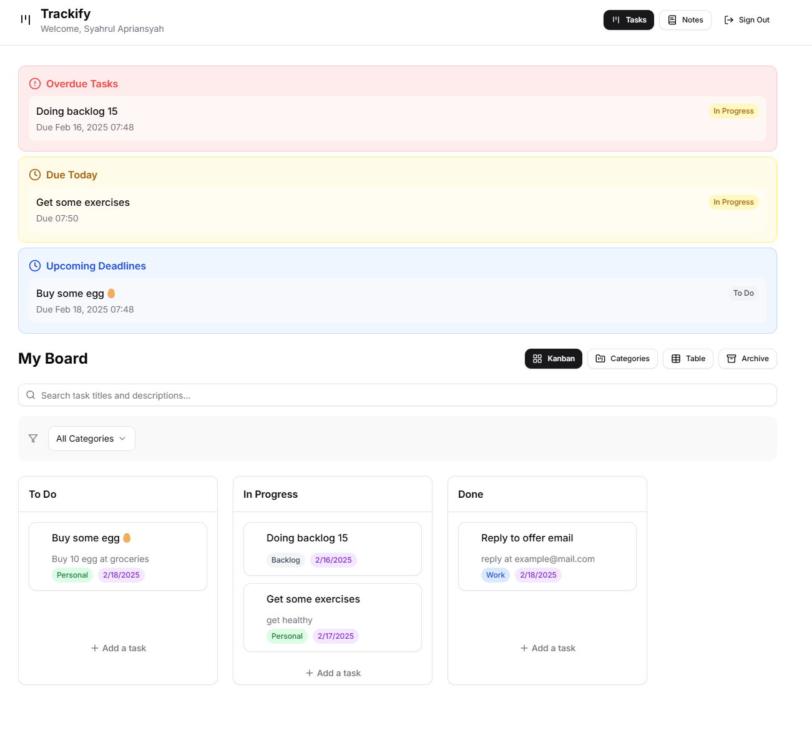

# Trackify

A modern task and note management application built with React, TypeScript, and Supabase. Trackify helps you organize your work with a beautiful Kanban board, daily notes, and powerful task management features.



## Features

### Task Management

- **Kanban Board**: Intuitive drag-and-drop interface for managing tasks
- **Multiple Views**:
  - Kanban board for visual task management
  - Table view with sorting and bulk actions
  - Category view for better organization
  - Archive for completed tasks
- **Rich Task Features**:
  - Deadline tracking with reminders
  - Customizable categories
  - Flexible tagging system
  - Detailed task descriptions
  - Status tracking (To Do, In Progress, Done)
  - Automatic archiving of completed tasks after 7 days

### Daily Notes

- Create and manage daily notes
- Date-based organization
- Quick view and edit functionality
- Focus on daily tasks and thoughts
- Organized grid layout view

### User Features

- Secure authentication
- Personal workspace
- Data privacy with row-level security
- Clean and intuitive interface

## Tech Stack

### Frontend

- React 18 with TypeScript
- Vite for fast development
- Tailwind CSS for styling
- Lucide Icons for beautiful icons
- Hello Pangea DND for drag-and-drop
- Radix UI for accessible components
- Date-fns for date manipulation
- Zustand for state management

### Backend

- Supabase (PostgreSQL)
- Row Level Security
- Real-time capabilities
- Secure authentication system

## Getting Started

### Prerequisites

- Node.js 16 or higher
- npm or yarn
- Docker and Docker Compose (for containerized deployment)
- Supabase account (for cloud deployment) or Docker (for self-hosting)

### Local Development

1. Clone the repository:

```bash
git clone https://github.com/SyahrulApr86/Trackify.git
cd Trackify
```

2. Install dependencies:

```bash
npm install
```

3. Set up environment variables:

```bash
# Create .env file
cp .env.example .env

# Add your Supabase credentials
VITE_SUPABASE_URL=your_supabase_url
VITE_SUPABASE_ANON_KEY=your_supabase_anon_key
```

4. Start the development server:

```bash
npm run dev
```

### Deployment Options

#### Option 1: Docker with Supabase Cloud

Use this option if you have a Supabase cloud project and want to deploy only the frontend.

1. Build and run with Docker Compose:

```bash
# Build the containers
docker compose build

# Start the services
docker compose up -d

# View logs
docker compose logs -f
```

2. Access the application at `http://localhost:8010`

#### Option 2: Docker with Self-hosted Supabase

Use this option if you want to run both the frontend and a complete Supabase backend locally.

1. Set up environment variables:

```bash
# Create .env file if not exists
cp .env.example .env

# Make sure RUN_SUPABASE=true in your .env file
# Fill in all Supabase-related variables
```

2. Build and run with Docker Compose including Supabase:

```bash
# Start both the app and Supabase services
docker compose --profile supabase up -d

# View logs
docker compose logs -f
```

3. Access the application at `http://localhost:8010`
4. Access Supabase Studio at `http://localhost:3000`

## Self-hosted Supabase Structure

When using the self-hosted Supabase option, the project is organized as follows:

```
├── app root (React application)
├── supabase
│   ├── migrations (Database migrations)
│   └── docker     (Self-hosted Supabase configuration)
│       ├── volumes
│       │   ├── api
│       │   ├── db
│       │   ├── functions
│       │   ├── logs
│       │   └── pooler
│       └── ... (other Supabase files)
```

## Database Setup

### Using Supabase Cloud

1. Create a new Supabase project
2. Run the migration files:

   ```bash
   # Navigate to migrations directory
   cd supabase/migrations
   
   # Apply migrations through Supabase dashboard or CLI
   ```

3. Enable Row Level Security (RLS)
4. Configure authentication settings

### Using Self-hosted Supabase

When using the self-hosted option with `docker compose --profile supabase`, the database will be initialized automatically. You can:

1. Access Supabase Studio at `http://localhost:3000`
2. Apply migrations manually if needed
3. Configure authentication settings

## Usage Guide

### Task Management

#### Creating Tasks

1. Click "Add a task" in any column
2. Fill in:
   - Title (required)
   - Description (optional)
   - Deadline (optional)
   - Category (optional)
   - Tags (optional)
3. Click "Create Task"

#### Managing Tasks

- **Drag & Drop**: Move tasks between columns
- **Edit**: Click on a task to view/edit details
- **Bulk Actions**: Use table view for multiple tasks
- **Filter**: By category, status, or tags
- **Search**: Find tasks by title or description

#### Categories

- Create custom categories
- Organize tasks by category
- Manage category settings

#### Archive

- View archived tasks
- Restore when needed
- Automatic archiving after 7 days

### Daily Notes

#### Creating Notes

1. Click "New Note"
2. Choose:
   - Date
   - Title (optional)
   - Content
3. Save note

#### Managing Notes

- View all notes in grid layout
- Click to view full details
- Edit or delete as needed
- Organize by date

## License

This project is licensed under the MIT License - see the [LICENSE](LICENSE) file for details.

## Acknowledgments

- [Lucide Icons](https://lucide.dev/) - Beautiful, consistent icons
- [Radix UI](https://www.radix-ui.com/) - Accessible component primitives
- [Tailwind CSS](https://tailwindcss.com/) - Utility-first CSS framework
- [Supabase](https://supabase.com/) - Open source Firebase alternative
- [Vite](https://vitejs.dev/) - Next generation frontend tooling
- [React](https://reactjs.org/) - A JavaScript library for building user interfaces
